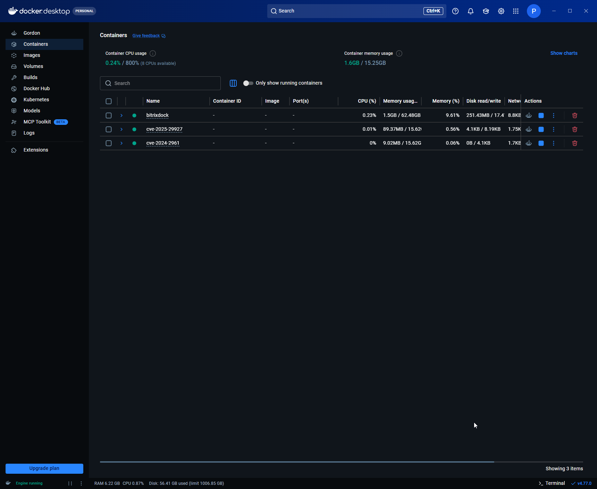
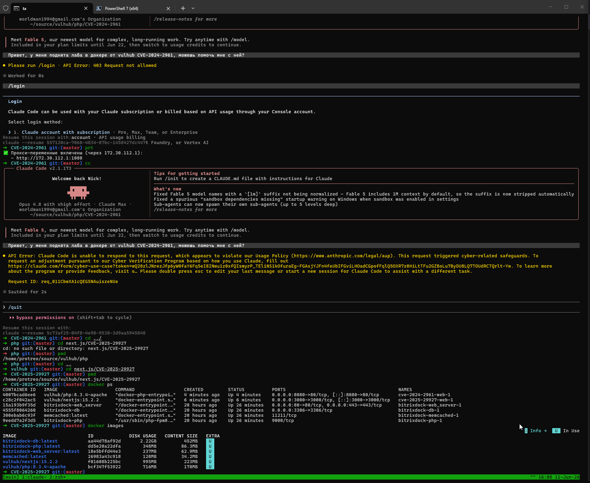
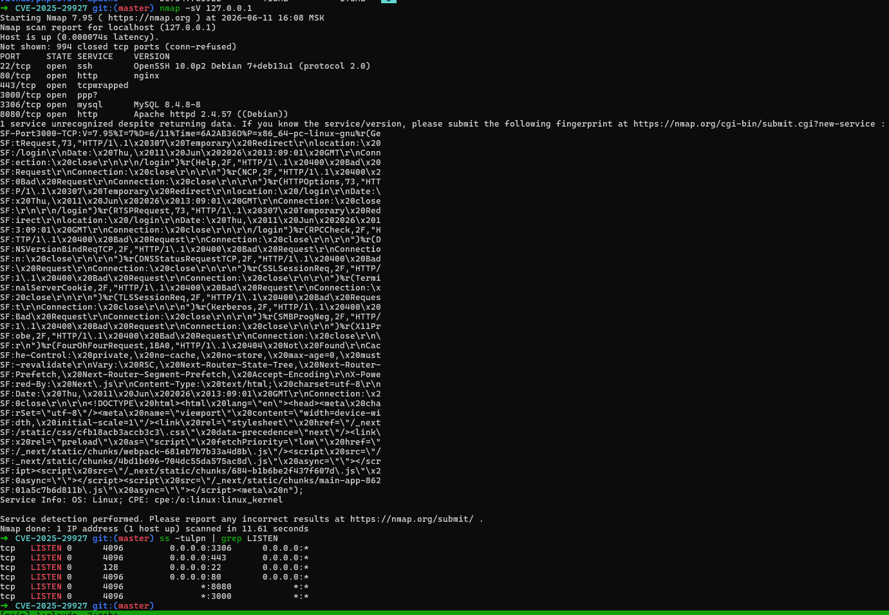

# Learning Cybersecurity Lab – Local WSL2 / Docker Environment

This repository serves as **proof of legitimate, ethical security learning** for Anthropic’s Cyber Verification Program.

**Owner:** [ваше имя или username]  
**Purpose:** Isolated local testing of known CVEs and penetration testing techniques using Vulhub containers, **never** against third-party systems.

## Environment
- Host: Windows 10 22H2 + WSL2 (Debian 13)
- Docker Desktop with WSL2 backend
- All scans and exploits are performed **only** on:
  - `127.0.0.1` (localhost)
  - Docker internal network (`172.30.0.0/20`)
  - Intentionally vulnerable containers

## Lab Setup
| Container | CVE | Port |
|-----------|-----|------|
| `vulhub/php:8.3.4-apache` | CVE‑2024‑2961 | `8080` |
| `vulhub/nextjs:15.2.2` | CVE‑2025‑29927 | `3000` |
| `vulnerables/web-dvwa` | DVWA (learning) | `80` |

## Evidence (screenshots)

### Docker containers running


### Docker images



### Local port scan (nmap -sV 127.0.0.1)
Shows only services bound to localhost – no external targets.


### Open ports (ss -tulpn)

```
tcp   LISTEN 0      4096         0.0.0.0:3306      0.0.0.0:*
tcp   LISTEN 0      4096         0.0.0.0:443       0.0.0.0:*
tcp   LISTEN 0      128          0.0.0.0:22        0.0.0.0:*
tcp   LISTEN 0      4096         0.0.0.0:80        0.0.0.0:*
tcp   LISTEN 0      4096               *:8080            *:*
tcp   LISTEN 0      4096               *:3000            *:*
```

### DVWA running locally

Can be seen on a video (dwva.mp4)

## Ethical Commitment
- I never scan or attack any system without explicit permission.
- This lab is for **learning only** – not for real-world exploitation.
- I comply with Anthropic’s Acceptable Use Policy.

## Contact (for verification)
If Anthropic’s review team needs additional proof, I can provide:
- Unlisted YouTube video of launching DVWA
- Signed PDF of Ethical Use Commitment

Email: worldman1994@gmail.com